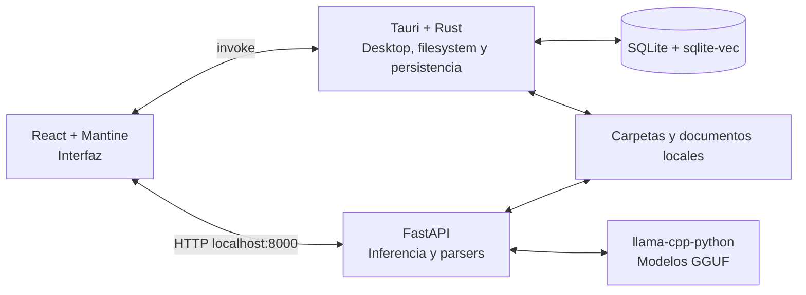

# MEMORIÓN

MEMORIÓN es una aplicación desktop experimental de memoria personal asistida por
modelos locales. Permite contarle información a un chat para recuperarla después
y vincular chats con carpetas del equipo para consultar el contenido textual de
sus documentos.

La inferencia ocurre localmente mediante modelos GGUF. MEMORIÓN no utiliza
Ollama ni envía los documentos a una API de IA externa.

> [!WARNING]
> MEMORIÓN está en desarrollo. No debe considerarse una fuente autoritativa, un
> sistema de respaldo ni un sustituto de revisar los documentos originales.

## Qué puede hacer actualmente

- Mantener un chat general y chats vinculados a carpetas locales.
- Descargar, verificar y cargar automáticamente un modelo de chat y otro de
  embeddings definidos en `backend/manifest.json`.
- Detectar afirmaciones declarativas del usuario y guardarlas como conocimiento
  recuperable mediante búsqueda vectorial.
- Escanear carpetas y subcarpetas con formatos habilitados por chat.
- Extraer y dividir texto de:
  - PDF con texto seleccionable (`.pdf`);
  - Word moderno (`.docx`);
  - JSON (`.json`);
  - Markdown (`.md`);
  - texto plano (`.txt`);
  - PowerPoint (`.pptx`);
  - Rich Text Format (`.rtf`);
  - XML (`.xml`).
- Generar embeddings de los chunks y buscarlos por similitud con `sqlite-vec`.
- Revisar las carpetas en segundo plano al iniciar. Primero compara tamaño y
  fecha de modificación; calcula SHA-256 solamente ante posibles cambios.
- Detectar archivos nuevos, modificados y eliminados y reconciliar su
  representación en SQLite.
- Recuperarse de una indexación interrumpida sin conservar chunks o vectores
  parciales.
- Consultar los knowledge items recientes en **Knowledge Logs** y corregir
  manualmente un conocimiento inválido. La corrección regenera también su hash y
  embedding sin perder la procedencia.
- Mostrar Markdown, tablas, listas, negritas y otros formatos en las respuestas.
- Mostrar métricas locales de actividad, archivos y carpetas encontradas.
- Abrir un formulario de GitHub para reportar comportamientos inesperados.

## Qué no hace

MEMORIÓN no hace magia ni comprende cualquier archivo arbitrario.

- No ejecuta OCR. Un PDF compuesto únicamente por imágenes no producirá texto
  útil.
- No analiza todavía `.csv`, `.xlsx`, `.doc` antiguo, imágenes, audio o video.
- No conserva el historial completo entre ejecuciones. Los mensajes son
  temporales; solo persisten los conocimientos que el flujo identifica y guarda.
- No garantiza que una afirmación sea verdadera. Conserva lo que una fuente
  afirma y puede responder incorrectamente o alucinar.
- No resuelve todavía contradicciones semánticas entre documentos ni determina
  por sí mismo cuál fuente tiene la verdad.
- Cuando cambia un documento, reemplaza sus chunks anteriores. Aún no mantiene
  una línea temporal semántica de hechos modificados.
- No muestra todavía citas precisas por página, párrafo o diapositiva en las
  respuestas.
- Los archivos adjuntos al chat general todavía no usan el pipeline documental
  completo de los chats de carpeta.
- No sincroniza información entre dispositivos, no es multiusuario y no tiene
  almacenamiento en la nube.
- SQLite no está cifrado actualmente. Los conocimientos y textos indexados deben
  considerarse datos locales legibles por quien tenga acceso al perfil del
  sistema operativo.
- Las gráficas de CPU y RAM muestran el consumo global del equipo, no únicamente
  el proceso de MEMORIÓN.
- El backend de FastAPI todavía no está empaquetado como sidecar dentro del
  instalador de Tauri. En desarrollo debe iniciarse por separado.

## Arquitectura



### Frontend

- React 19
- TypeScript
- Mantine
- Tabler Icons
- Vite

El frontend administra navegación, estado visual, solicitudes de chat,
orquestación de indexación y presentación de Markdown.

### Desktop y persistencia

- Tauri 2
- Rust
- `rusqlite`
- `sqlite-vec`
- `sysinfo`

Tauri selecciona archivos y carpetas, obtiene identidad y metadatos del
filesystem, calcula hashes, ejecuta migraciones y conserva el conocimiento en
SQLite.

### IA y procesamiento documental

- FastAPI
- `llama-cpp-python`
- PyMuPDF
- `python-docx`
- `markdown-it-py`
- `python-pptx`
- `striprtf`
- `lxml`

FastAPI carga dos capacidades desacopladas:

- `chat`: conversación y extracción de afirmaciones.
- `embedding`: representación vectorial de consultas y conocimiento.

El código no depende de nombres comerciales de modelos. Las rutas, URLs,
versiones y hashes pertenecen al manifest.

## Flujo de conocimiento

### Memoria desde el chat

```text
Mensaje del usuario
→ clasificación de afirmación
→ conocimiento candidato
→ segunda revisión: conservar, reformular, fusionar o dividir
→ conocimientos autocontenidos
→ embeddings
→ knowledge_items + knowledge_vectors
```

Las preguntas, saludos y órdenes no deberían guardarse como conocimiento. La
clasificación depende de un modelo y puede equivocarse.

### Memoria desde documentos

```text
Archivo admitido
→ parser según extensión
→ texto normalizado
→ chunks con solapamiento
→ extracción de conocimientos candidatos
→ segunda revisión semántica
→ conocimientos autocontenidos
→ embeddings
→ knowledge_items + knowledge_vectors
```

Al hacer una pregunta en un chat de carpeta, MEMORIÓN busca vectores únicamente
en el alcance de esa carpeta y entrega los conocimientos relevantes al modelo de
chat.
Los conocimientos nacidos del mismo fragmento comparten `document_id` y
`chunk_index`. Para trazabilidad se conserva el hash del chunk y un extracto
breve, no una segunda copia completa del texto fuente.

### Reindexación

En cada arranque se realiza una comprobación secuencial en segundo plano:

1. Se enumeran los formatos habilitados.
2. Se comparan ruta, tamaño y fecha de modificación.
3. Si los metadatos coinciden, el archivo se omite.
4. Si parecen haber cambiado, se calcula SHA-256.
5. Si el hash coincide, solo se actualizan los metadatos.
6. Si el hash cambió, se reemplazan los chunks y embeddings del documento.
7. Si un archivo desapareció, sus registros se eliminan por cascada.

Una indexación incompleta no se considera válida. Al reiniciar, MEMORIÓN limpia
chunks parciales y devuelve el documento a estado pendiente.

## Modelo de datos resumido

- `folder`: chats vinculados a carpetas.
- `folder_extension`: formatos habilitados por carpeta.
- `document`: identidad, ruta, hash y estado de indexación.
- `session_message`: historial temporal de la ejecución actual.
- `knowledge_origin`: entrada o contexto que originó un conocimiento.
- `knowledge_item`: texto recuperable, chunk o afirmación.
- `knowledge_vector`: embedding almacenado mediante `sqlite-vec`.
- `ai_model`: modelos locales registrados.
- `model_capability`: capacidades de chat o embedding.
- `model_assignment`: asignaciones activas para tareas internas.

Las eliminaciones de un chat de carpeta se propagan por claves foráneas y
triggers hacia documentos, conocimientos y vectores. Los archivos físicos de la
carpeta no se eliminan.

## Datos locales

Los modelos no se guardan en el repositorio. Las rutas se resuelven
dinámicamente mediante los directorios de datos de la aplicación.

En Windows, la instalación de desarrollo actual utiliza normalmente:

```text
%LOCALAPPDATA%\MEMORIÓN\models\
%LOCALAPPDATA%\MEMORIÓN\data\memorion.sqlite3
%LOCALAPPDATA%\MEMORIÓN\logs\model-download.log
```

SQLite utiliza modo WAL, por lo que durante la ejecución pueden existir también:

```text
memorion.sqlite3-wal
memorion.sqlite3-shm
```

No deben separarse ni copiarse individualmente mientras la aplicación está
abierta.

## Requisitos de desarrollo

- Node.js y `pnpm`
- Rust estable y los requisitos de compilación de Tauri para el sistema
  operativo
- Python con soporte para las dependencias de `llama-cpp-python`
- Git
- Conexión a internet para instalar dependencias y descargar los modelos la
  primera vez
- Espacio disponible para ambos GGUF

En Windows se está desarrollando actualmente con Python 3.12.

## Instalación

Desde la raíz del repositorio:

```powershell
cd MEMORIÓN
pnpm install
python -m venv .venv
.\.venv\Scripts\Activate.ps1
python -m pip install --upgrade pip
python -m pip install -r backend/requirements-dev.txt
```

En Linux o macOS, la activación del entorno cambia a:

```bash
source .venv/bin/activate
```

`llama-cpp-python` puede requerir una wheel compatible o herramientas de
compilación nativa según la plataforma.

## Ejecución en desarrollo

FastAPI y Tauri se ejecutan actualmente como procesos separados.

Terminal 1:

```powershell
.\.venv\Scripts\Activate.ps1
python -m uvicorn backend.main:app --host 127.0.0.1 --port 8000
```

Terminal 2:

```powershell
pnpm tauri dev
```

FastAPI comenzará a verificar o descargar los modelos durante su arranque. El
estado puede consultarse en:

```text
GET http://127.0.0.1:8000/health
GET http://127.0.0.1:8000/api/models/status
GET http://127.0.0.1:8000/api/models/events
```

## Configuración de modelos

[`MEMORIÓN/backend/manifest.json`](MEMORIÓN/backend/manifest.json) define las capacidades `chat` y
`embedding`:

```json
{
  "version": "1.0.0",
  "models": {
    "chat": {
      "filename": "chat.gguf",
      "url": "https://...",
      "sha256": "..."
    },
    "embedding": {
      "filename": "embedding.gguf",
      "url": "https://...",
      "sha256": "..."
    }
  }
}
```

La descarga usa streaming, reintentos y archivos temporales. Un modelo existente
solo se reemplaza después de verificar correctamente el SHA-256 del nuevo
archivo.

Variables opcionales:

```text
MEMORION_CHAT_N_CTX
MEMORION_EMBEDDING_N_CTX
MEMORION_MODEL_THREADS
```

## Pruebas y validación

Backend:

```powershell
python -m pytest backend/tests -q
```

Frontend:

```powershell
pnpm exec tsc --noEmit
pnpm build
```

Tauri y SQLite:

```powershell
cd src-tauri
cargo test
cargo check
```

## Build desktop

```powershell
pnpm tauri build
```

El comando genera los artefactos de Tauri, pero el producto todavía no es una
distribución completamente autónoma porque FastAPI, Python, sus parsers y
`llama-cpp-python` no están empaquetados como sidecar.

## Mantenimiento destructivo

El repositorio incluye
[`MEMORIÓN/src-tauri/maintenance/nuke_chat_data.sql`](MEMORIÓN/src-tauri/maintenance/nuke_chat_data.sql),
que elimina chats, documentos, conocimientos y vectores conservando las tablas
de modelos. No debe ejecutarse sin respaldo y requiere una conexión con
`sqlite-vec` cargado.

## Licencia

Este proyecto se distribuye bajo la
[Apache License 2.0](LICENSE).

## Reportar problemas

Los errores y comportamientos extraños pueden reportarse en:

[Crear un issue](https://github.com/andreroblesb/MEMORI-N/issues/new)

Al reportar, evita adjuntar bases SQLite, documentos personales, prompts
sensibles o rutas que revelen información privada.
